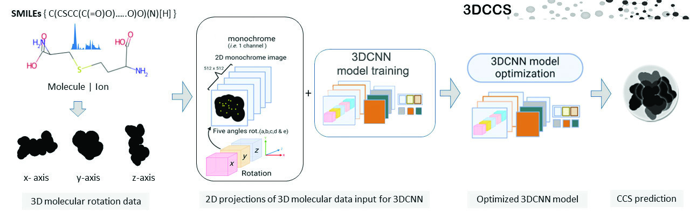
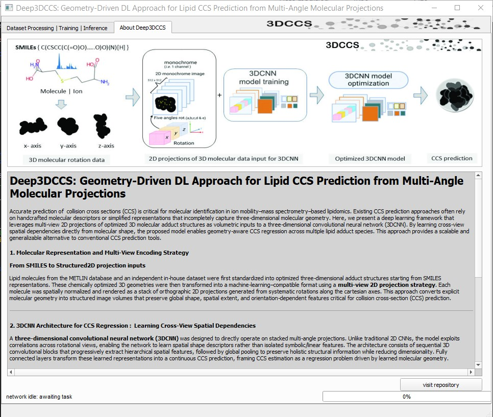
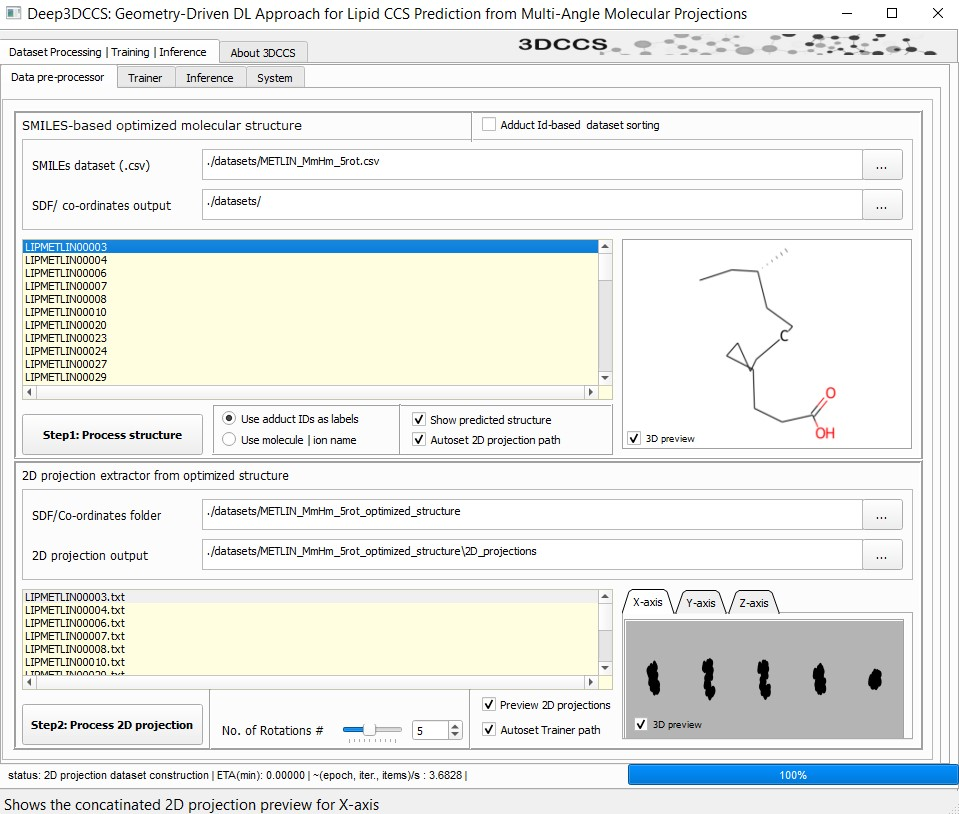
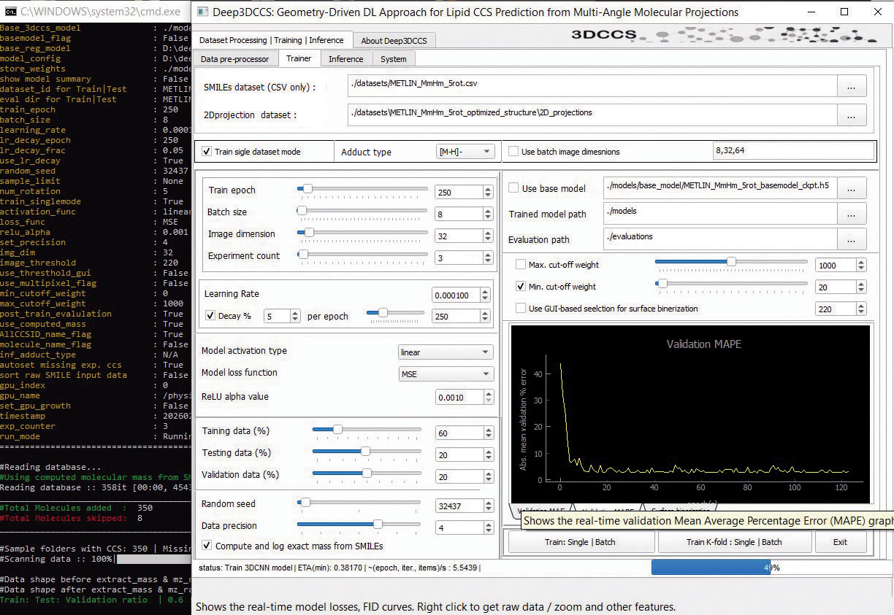
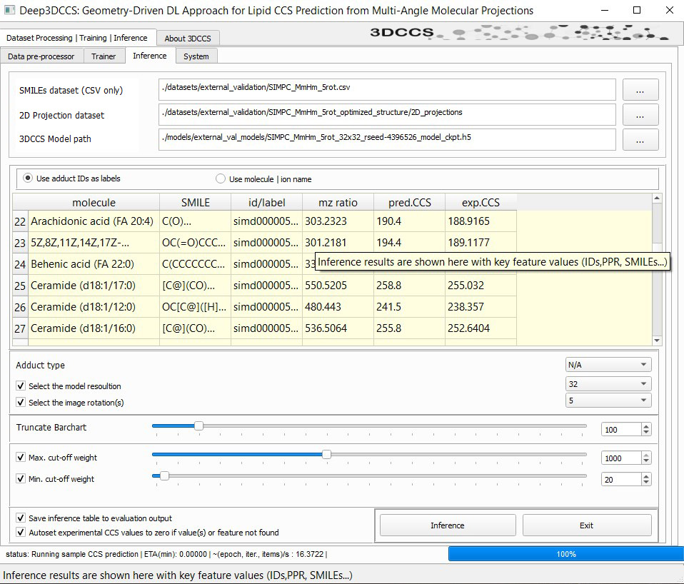

# Deep3DCCS

**Deep Learning Approach for CCS Prediction from Multi-Angle Projections of Molecular Geometry**

---

## Overview

**Deep3DCCS** is a comprehensive deep learning framework for predicting **Collision Cross-Section (CCS)** values using three-dimensional molecular structure information derived from mass spectrometry data. The framework employs a specialized **3D Convolutional Neural Network (3DCNN)** operating on **multi-angle 2D projections** of molecular geometries. This design bridges molecular structure representation with ion mobility spectrometry, enabling accurate CCS prediction for applications in **metabolomics, lipidomics, and structural biology**.

---
## Schematics of Deep3DCCS




## Key Features

### Molecular Structure Processing
- Converts **SMILES** into optimized **3D molecular structures**
- Utilizes **Gaussian View 6.0 / Gaussian 16**, **RDKit**, and computational chemistry methods
- Generates physically realistic geometries suitable for CCS modeling

### Multi-View 2D Projections
- Generates rotational 2D projections around **x-, y-, and z-axes**
- Configurable rotational increments (1, 3, 5, or 10 angles per axis)
- Image resolutions from **8×8 to 192×192 pixels**
- Center-of-mass recentering and van der Waals surface visualization

### 3DCNN Regression Model
- Custom **3D CNN architecture** optimized for CCS regression
- Processes volumetric stacks of multi-angle projections
- Includes 3D convolution blocks, global average pooling, and dense regression layers

### Automated Workflow (GUI)
- **PyQt5-based graphical interface**
- End-to-end pipeline from SMILES input to CCS prediction
- Modular workflow tabs:
  - Molecular Structure Optimization and 3D Structrue construction 
  - Multi-view 2D Projection dataset Generation
  - Model Training /Parameter optimization/ Corss-validation
  - Inference

### Comprehensive Evaluation
- Primary metric: **Relative Percentage Error (RPE)**
- Additional metrics: MAE, MAPE, Pearson r, R², standard error
- Automated visualizations:
  - Scatter plots
  - Residual density plots
  - QQ plots
  - Comparative bar charts

---

## Installation

### Prerequisites
- **Python ≥ 3.7** (tested with TensorFlow 2.10)
- Supported OS: **Windows 10/11**, **Ubuntu 20.04/22.04**
- _env (for windows system) will contain all virtual environment required for running Deep3DCCS. the portable version will be all _env embedded. Users are required to install CUDA v11.0 and cUDNN 8.5+ for proper running of GPU-version

  
### Hardware Recommendations
- **GPU (recommended):** NVIDIA CUDA-compatible GPU (≥ 8 GB VRAM)
- **RAM:** ≥ 16 GB (can run smoothly in 12 GB ram for low resoultion models ) 
- CPU-only execution supported for small datasets trainining and inferencing

### Clone Repository
```bash
git clone https://github.com/vivekmathema/Deep3DCCS.git
cd Deep3DCCS
Deep3DCCS > run_3dccs.bat (for windows)  |  Deep3DCCS > python3 3dcnn_main.py  (for linux)
```

### Core Dependencies
```bash
pip install tensorflow==2.6.0
pip install keras==2.6.0
pip install scipy==1.4.1
pip install rdkit-pypi
pip install pyqt5 matplotlib numpy pandas scikit-learn opencv-python pillow seaborn tqdm colorama termcolor 
```

### RDKit (Alternative via Conda)
```bash
conda install -c conda-forge rdkit
conda install -c conda-forge openbabel
```

### Installation Verification
```bash
python -c "import tensorflow as tf; import rdkit; print('Installation successful:', tf.__version__)"
```

> A standalone **portable Windows (64-bit)** version will be released in the future upon acceptance of the manuscript.

---

## Usage

### GUI Interface
Launch the main application:
```bash
python deep3dcnn_main.py.py
```

---
## Graphical user friendly inferface of Deep3DCCS (beta version)
The Deep3DCCS is a complete GUI-feature enagled software toolkit that can be run locally for both training and inference with full customization. Hovering mouse on most of the buttons in GUI interface will prvide users short description of its corrsponding functions.

**Welcome screen for Deep3DCCS gui inferface**





**The Deep3DCCS data pre-processing module**





**The Deep3DCCS data Model training module**




**The Deep3DCCS data Inference/ccs prediction using trained module**




The GUI provides:
- **Molecular Optimization:** SMILES → optimized 3D structures
- **2D Projection Generation:** Multi-angle image stacks
- **Model Training:** Architecture and hyperparameter configuration
- **Inference:** CCS prediction on unseen molecules

### Command-Line Tools
- **TO DO: in future version** , currently to make the users familiar with all steps and avoid any confusion in parameters setting, only GUI version is available.
---

## Experimental Workflow

### Sample pre-processing (for both Training and inference)
**Pre-processing Step #1:** Select the CSV or XLS files contanining sample IDs, SMILES, Adduct information to create standard 3D image dataset
**Pre-processing Step #2:** Select the subsequent 3D image dataset to creat final 2D training dataset angle projection dataset. 

**This 2D projection dataset along with the original SampleID CSV/XLS file is used for training/testing and inference/external validation (if unknown)**

###  Optimization of Training Models 
** There is no golden rule to idetify best model training/optimiation parameters in deep learnining/machine learnining. We suggest conducting two step experimentation to: (i) First identlty a potentially suitable parameters using random sampling for model training (ii) Using 4-fold cross-validation with the observed most accurate parameters configuration for model optimization. Finally use thwe optimized model for inference. Additionaly, the optimized model parameteres can be used to train on entire train/test dataset and futher validated on external validation dataset to access the real-world generalization of the optimized model. 

### Experiment 1: Resolution & Rotation Optimization
- Resolution range: **8×8 to 192×192**
- Rotations per axis: **1–10**
- 40 replicates per configuration
- Training: 250 epochs, batch size 8, Adam (lr=1e-4)

### Experiment 2: 4-Fold Cross-Validation
- Optimal parameters from Experiment 1
- Stratified 4-fold split by adduct
- 15 replicates with different random seeds

---
Rotation-specific datasets are generated by changing the “Xrot” label in the filename and selecting the same rotation value (e.g., 5rot) in the software. The RAW CSV/XLS files remain identical; only the software’s processing differs.

A single RAW dataset per adduct can generate all rotation variants. Separate datasets are provided here only for demonstration. Based on the selected 2D projection configuration, the software automatically generates the corresponding 3D dataset and 2D projections.

Optional: An identical Microsoft XLS file is included for better annotation and customization of the input data.

---

## Model Architecture

- Input: *(N_rotations × H × W × Channels)*
- 4 × 3D convolution blocks (32 → 64 → 128 → 256 filters)
- Batch normalization + anisotropic pooling
- GlobalAveragePooling3D
- Dense layers: 128 → 64 (LeakyReLU, Dropout 0.3)
- Output: Single linear neuron (CCS regression)

Optimizer: **Adam (lr=0.0001)**  
Metrics: MSE, MAE, MAPE

---

## Repository Structure
```
Deep3DCCS/
├── deep3dcnn_main.py.py
├── _core.py
├── utility_modules.py
├── helper_tools.py
├── ui_interface.ui
├── run_deep3DCCS_GPU.bat
├── run_deep3DCCS_CPU.bat
├── datasets/
├── models/
├── evaluations/
├── configs/
├── assets/
├── requirements-cpu.txt
└── requirements-gpu.txt
```

NOTE: For inference or prediction on molecules with unknown experimental CCS values, the option “Autoset experimental CCS values to zero if value(s) or feature not found” must be enabled. This forces all experimental CCS values to zero.
This option is applicable to CSV SMILES input datafiles that lack the exp_ccs column entirely or contain missing values (e.g., N/A or NULL)for some molecules. In both cases, the scoring metrics reported below are not meaningful, as no comparison with known experimental CCS values is possible.


## Evaluation Metrics

- **Relative Percentage Error (RPE)**
- Mean Absolute Error (MAE)
- Mean Absolute Percentage Error (MAPE)
- Pearson Correlation (r)
- Coefficient of Determination (R²)
- Deming regression parameters

**Interpretation Guide:**
- RPE < 3%: Excellent
- 3–5%: Good
- 5–10%: Moderate
- >10%: Requires refinement

---

## Benchmarking

Deep3DCCS is benchmarked against:
- **CCSBASE**
- **ALLCCS**

Evaluation includes RPE distribution, paired statistical tests, computational efficiency, and external dataset validation.

---


## Output Files

- **3D Structures:** SDF + Cartesian coordinate files
- **2D Projections:** PNG stacks with JSON metadata
- **Models:** HDF5 (.h5) + checkpoints
- **Results:** CSV, JSON summaries, publication-quality plots

---

## Citation

If you use Deep3DCCS, please cite the paper
:

```bibtex
@article{deep3dccs2024,
  title={Deep3DCCS: Deep Learning Approach for CCS Prediction from Multi-Angle Projections of Molecular Geometry},
  author={Siriraj Metabolomics \& Phenomics Center},
  journal={Journal of Cheminformatics},
  year={2026},
  publisher={Springer}
}
```

---

## License

This project is licensed under the **MIT License**. See `LICENSE` for details.

---

## Contact

**Siriraj Metabolomics & Phenomics Center (SiMPC)**  
Faculty of Medicine Siriraj Hospital  
Mahidol University, Bangkok 10700, Thailand

---

## Funding & Acknowledgments

Supported by:
- National Higher Education Science Research and Innovation Policy Council (NXPO)
- PMU-B (Program Management Unit for Human Resource & Institutional Development)

Computational resources provided by the **SiMPC High-Performance Computing Facility**.

---

> **Note:** Deep3DCCS is an active research project. Please check the GitHub repository for updates, report issues, and refer to documentation for advanced usage.

